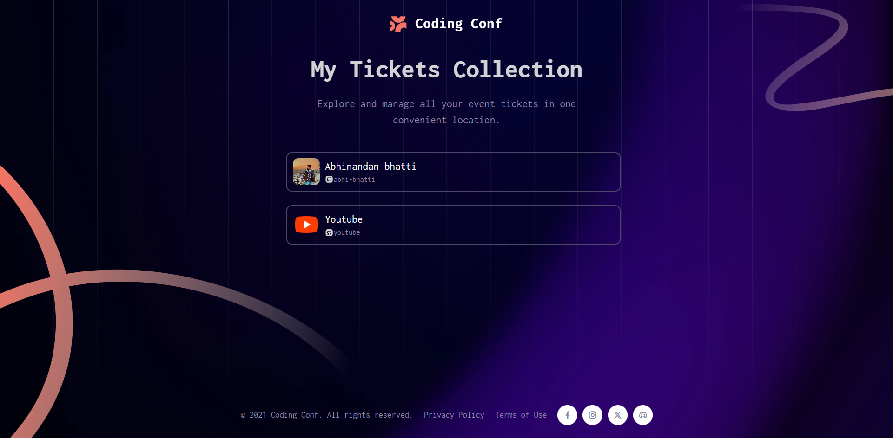
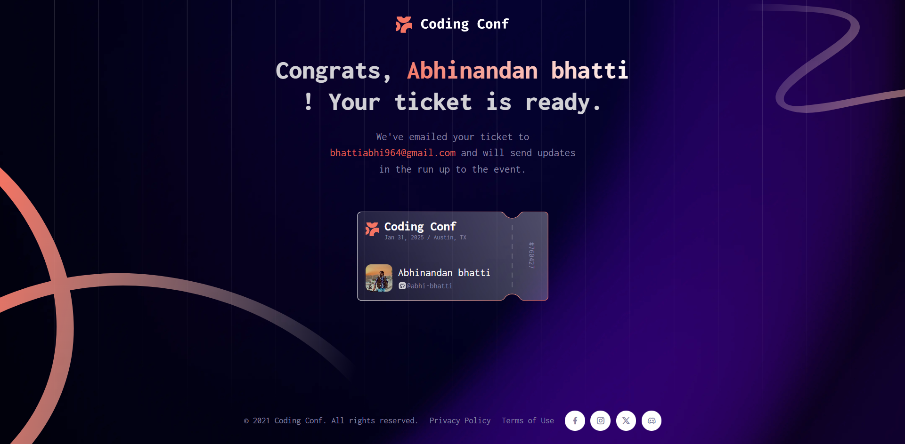

# Conference Ticket Generator

Welcome to the **Conference Ticket Generator**, a web application designed for generating, managing, and displaying tickets for Coding Conf 2025. This project includes functionality for users to register, upload their avatar, and receive a personalized ticket. Users can also view and manage all their tickets.

---

## Table of Contents

- [Overview](#overview)
- [Features](#features)
- [Technologies Used](#technologies-used)
- [Setup](#setup)
- [File Structure](#file-structure)
- [Usage](#usage)
- [Screenshots](#screenshots)

---

## Overview

This project simulates a ticket generation and management system for a coding conference. Users can:

1. Register by providing their name, email, and GitHub username.
2. Upload an avatar image (JPG or PNG, max size: 2MB).
3. View personalized tickets with their details.
4. Manage multiple tickets on the "All Tickets" page.

---

## Features

- **Responsive Design**: Optimized for devices of all sizes.
- **Dynamic Data Handling**: Uses `localStorage` to store and retrieve ticket data.
- **Interactive Forms**: Includes validation for inputs such as name, email, and GitHub username.
- **Navigation**: Smooth navigation between pages for ticket details and management.
- **Avatar Upload**: Allows users to upload profile images for their tickets.

---

## Technologies Used

- **HTML5**
- **CSS3** (with custom styles and reusable components)
- **JavaScript** (including DOM manipulation and event handling)
- **LocalStorage** for persisting user data.
- **Remix Icon Library** for social and UI icons.

---

## Setup

1. Clone this repository:
   ```bash
   git clone <repository-url>
   ```
2. Navigate to the project folder:
   ```bash
    cd conference-ticket-generator 
    ```
3. Open the index.html file in your browser to view the application:
   ```bash
   open index.html
   ```

## File Structure
```css
project-folder/
│
├── assets/
│   ├── images/
│   │   ├── favicon-32x32.png
│   │   ├── logo-full.svg
│   │   ├── icon-upload.svg
│   │   └── [additional images]
│   └── [other assets]
│
├── scripts/
│   ├── main.js
│   └── display-data.js
│
├── styles/
│   ├── style.css
│   ├── ticket-info.css
│   └── all-tickets.css
│
├── index.html
├── ticket-info.html
└── tickets.html
```   

## Usage

1. Generate a Ticket:

   - Visit the homepage (index.html).
   - Fill out the registration form and upload an avatar.
   - Click the "Generate My Ticket" button to proceed.
2. View All Tickets:
   - Navigate to the "View all tickets" page to see a list of saved tickets.
3. Detailed Ticket View:
   - Click on a ticket from the list to view its detailed information.

## Screenshots

### Homepage


### All Tickets Page


### Final Output



